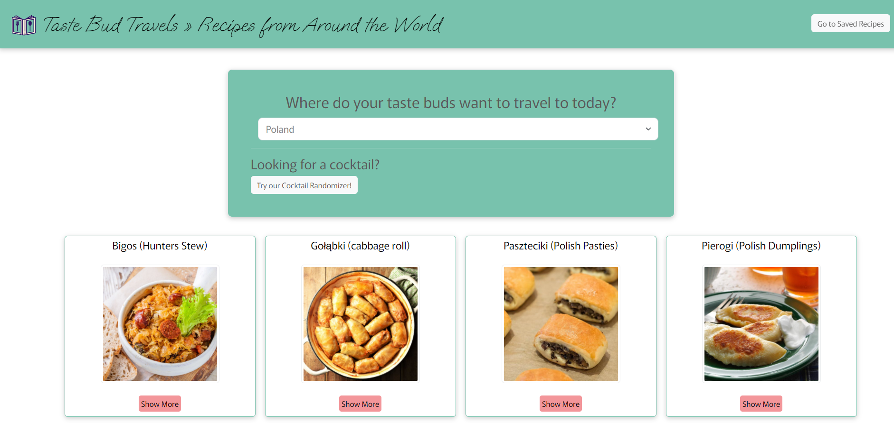
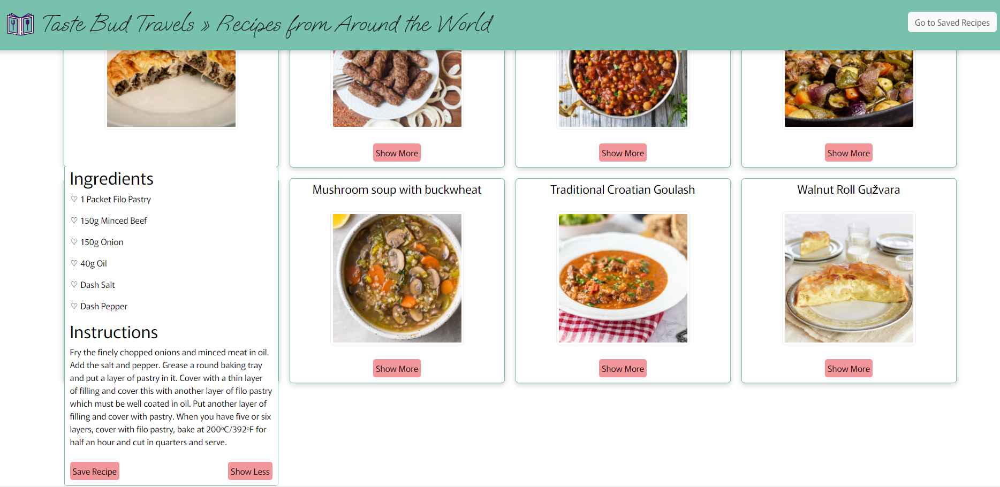
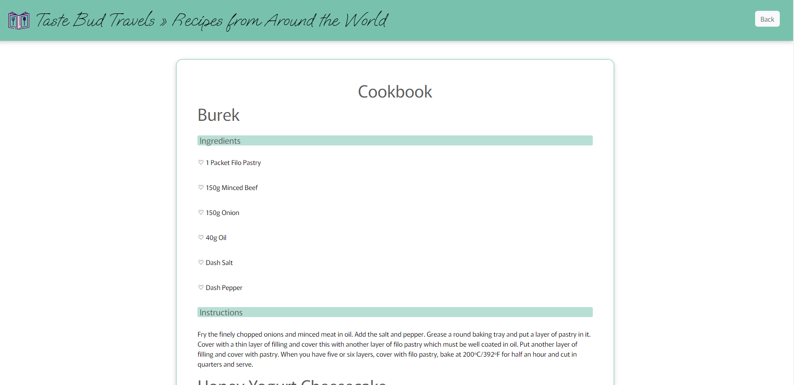
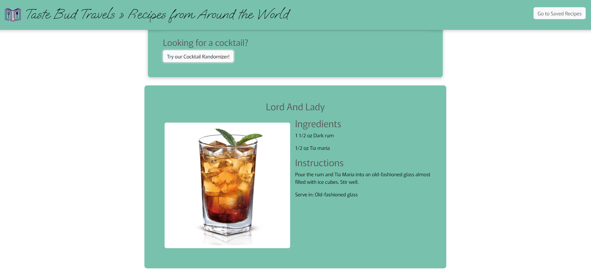

# International Dishes

[Live Site](https://carring10.github.io/international-dishes/)

## Table of Contents
1. [Description](#Description)
2. [Visual](#Visual)

## Description
This is a website that calls upon [TheMealDB](https://www.themealdb.com/api.php) and [TheCocktailDB](https://www.thecocktaildb.com/api.php) APIs for recipe and cocktail information. Users are able to search by country for recipes and use a randomizer button for cocktails.

## Visual

